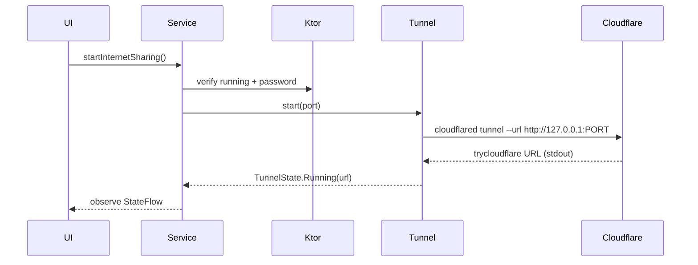

# Internet Sharing (developer notes)

## Architecture

```
MainActivity (UI)
    |
    v
FileServerService (foreground, owns lifecycle)
    |
    +--> KtorServer (LAN + origin HTTP on 0.0.0.0:PORT)
    |
    +--> CloudflareTunnel (cloudflared child process)
              |
              v
       Cloudflare Quick Tunnel edge
              |
              v
           Internet (https://*.trycloudflare.com)
```

- **Ktor remains the only HTTP server.** cloudflared is transport only.
- Origin for the tunnel is always `http://127.0.0.1:<Constants.SERVER_PORT>` (never the Wi‑Fi IP).
- Internet Sharing is **optional** and **off by default**. Starting the LAN server does **not** start a tunnel.
- The Quick Tunnel URL is **ephemeral** and is **not persisted**.



## Process lifecycle

1. User starts LAN server → `FileServerService` starts Ktor.
2. User taps **Start Internet Sharing**.
3. Service verifies password, sets session flag `internetSharingDesired`.
4. `CloudflareTunnel.start(port)` launches packaged `libcloudflared.so`.
5. Stdout/stderr (merged) consumed on a background coroutine; first valid `*.trycloudflare.com` URL → `Running`.
6. Startup timeout: **30s** → `Error`.
7. Stop Internet Sharing / Stop Server / `onDestroy` → `destroy()` then `destroyForcibly()` on the owned `Process` only.

Idempotent: second start while Starting/Running is ignored; second stop is safe.

## Binary packaging

| Item | Value |
|------|--------|
| cloudflared version | **2025.8.1** |
| Source | https://github.com/cloudflare/cloudflared/releases/tag/2025.8.1 |
| License | Apache License 2.0 (Cloudflare) |
| ABIs | `arm64-v8a` (linux-arm64), `x86_64` (linux-amd64, emulators) |
| Packaging | `app/src/main/jniLibs/<abi>/libcloudflared.so` |
| Release ABI | **arm64-v8a only** (debug also packs `x86_64` for emulators) |
| Why `.so` name | Android extracts jniLibs into `nativeLibraryDir` with **execute** permission |
| SHA-256 arm64 | `9e2088063c8b8f71ce4b15d65e6f4b1ef345f90c9c15e762cfd2bc8fc63cf22a` |
| SHA-256 x86_64 | `a66353004197ee4c1fcb68549203824882bba62378ad4d00d234bdb8251f1114` |

Refresh binaries:

```bash
./scripts/download-cloudflared.sh
```

Update `CloudflareTunnel.CLOUDFLARED_VERSION` / `EXPECTED_SHA256` and this doc when bumping.

Fallback: if jniLibs binary is missing, `CloudflareTunnel` can copy from `assets/cloudflared/<abi>/cloudflared` into `filesDir` (app-private). Preferred path is still jniLibs.

**Do not** ship a random desktop binary without verifying ELF arch (`file` should show `ARM aarch64` for arm64-v8a).

## ABI selection

`Build.SUPPORTED_ABIS` is scanned; first match in `{arm64-v8a, x86_64}` wins. Unsupported ABI → user-facing error (no crash).

## URL parsing / Android DNS bootstrap

`CloudflareTunnelUrlParser` accepts only `https://<host>.trycloudflare.com`. Strips ANSI CSI sequences. Unit-tested.

On Android, packaged linux `cloudflared` **cannot resolve DNS** (`lookup … on [::1]:53` — no `/etc/resolv.conf`).

`QuickTunnelBootstrap` therefore:

1. `POST https://api.trycloudflare.com/tunnel` via Java (`HttpURLConnection` — Android DNS works)
2. Writes credentials + config under `cacheDir`
3. Resolves `region*.v2.argotunnel.com` to IPv4 via `InetAddress`
4. Starts `cloudflared tunnel --config … --edge IP:7844 … run <id>`

Public URL comes from the API response immediately.

## Service integration

| API | Role |
|-----|------|
| `startInternetSharing()` | Validate + set desire + start tunnel |
| `stopInternetSharing()` | Clear desire + stop tunnel (LAN stays up) |
| `isInternetSharingEnabled()` | Session desire flag |
| `tunnelState: StateFlow` | UI observation |
| `shouldSkipIpApprovalForRemoteHost()` | Skip LAN IP dialog for loopback (tunnel path) |

## Foreground service

Same `FileServerService` / `dataSync` FGS. Notification text becomes “Internet sharing active” while tunnel Starting/Running; optional **Stop Internet Sharing** action.

## Error handling

User-facing strings only (see `strings.xml`). Technical detail → Timber tag `TransferCloudflareTunnel`.

## Security model

1. Password Basic Auth is **optional** (Settings). Recommended for Internet Sharing but not required.
2. While Internet Sharing is on, the **tunnel path is read-only** (no upload/delete/PUT via the public link). LAN clients keep write access.
3. LAN IP approval is **not** Internet security. Tunnel requests appear as `127.0.0.1` (cloudflared → localhost). Those hosts skip IP approval while Internet Sharing is desired.
4. Quick Tunnel URL is temporary HTTPS at Cloudflare’s edge; origin on-device remains HTTP loopback.
5. No auto-start after reboot. Desire flag is in-memory only.

### Public exposure audit (expected)

| Action | Unauthenticated Internet user |
|--------|-------------------------------|
| `/`, list, download, upload, delete, zip | Open if no password; **401** if password set |
| Path traversal / escape DocumentFile tree | Existing DocumentFile `findFile` + sanitize still apply |
| Outside shared folder | Not reachable via API |

## Network-change behavior

If `internetSharingDesired` and Ktor restarts (IP change / preference change):

1. Stop old tunnel  
2. Restart Ktor (existing logic)  
3. Start new tunnel → **new** public URL  

## Test strategy

- Unit: `CloudflareTunnelUrlParserTest`, lifecycle fakes via `TunnelProcessLauncher`
- Instrumentation: existing `AppFlowTest` (LAN). Do **not** require live Cloudflare in CI.
- Device: manual Quick Tunnel check (see README)

## Upgrading cloudflared

1. Pick a GitHub release tag.  
2. Update checksums in `scripts/download-cloudflared.sh` + `CloudflareTunnel`.  
3. Run the script.  
4. `file` / on-device `cloudflared tunnel --help`.  
5. Smoke Quick Tunnel.  
6. Commit binaries (or Git LFS) + docs.

## Licensing / attribution

cloudflared is copyright Cloudflare, Inc., licensed under the **Apache License 2.0**. See `THIRD_PARTY_CLOUDFLARED.md`.

## Known limitations

1. Quick Tunnel URL is temporary and changes on restart.  
2. Requires app + FGS + tunnel process to keep running.  
3. Cloudflare operates the public edge.  
4. Throughput limited by phone upload / radio.  
5. Battery / OEM background limits may affect long sessions.  
6. Intended for **temporary** sharing, not permanent hosting.  
7. APK size grows ~35–40 MB per ABI included.  
8. No bandwidth or uptime SLA claimed.  
9. Works behind CGNAT; no port forward / domain / VPS.  
10. `armeabi-v7a` not packaged (add only if needed + verified).
